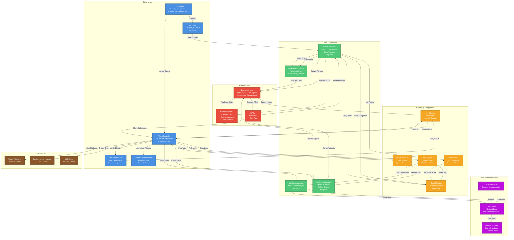

# Spy-VS-Spy

Fast local-network multiplayer for two players. One hosts, one joins, and both race to outplay each other with movement, items, and mini-games.

## Requirements
- Two players on the same local network
- One player acts as Host, the other as Client
- Keyboards or controllers (controls below assume keyboard)

## Setup and Lobby

### Single Player Mode
1) Launch the game.
2) Click **Start Game** in the main menu.
3) Select **Single Play**.
4) Choose a level from the dropdown menu.
5) Click **Start Game** to begin.

### Multiplayer Mode
1) Launch the game on both devices (both must be on the same local network).
2) Click **Start Game** in the main menu.
3) Select **Multi Play**.

**For the Host:**
4) Enter the host IP (or leave default).
5) Click **Host** to start hosting.
6) Select a level from the dropdown menu while waiting.
7) Once Player 2 joins (Joined Players: 2), click **Start Game** to begin.

**For the Client:**
4) Enter the host's IP address.
5) Click **Join** to connect to the host.
6) Wait for the host to start the game.

## Core Controls
- `A` move left
- `D` move right
- `Space` jump
- `E` pick up item
- `Q` use held item

## Playing the Match
- Move, jump, and collect items to gain advantages.
- Use items at key moments to disrupt your opponent or secure objectives.
- Some rounds include mini-games; follow on-screen prompts to complete them.

## Item System

### How Items Work
1. **Picking Up**: Press `E` near a chest or item spawn point to pick up an item. The item is held and displayed in your inventory.
2. **Holding**: You can carry only one item at a time. Picking up a new item while holding another will drop the previously held item.
3. **Using**: Press `Q` to consume/use the held item. Effects are applied immediately and the item is removed from inventory.
4. **Item Effects**: Each item provides a unique benefit:
   - Speed boosts increase movement speed temporarily
   - Jump boosts increase jump height temporarily
   - Steal items take your opponent's held item and give it to you
   - Other items provide context-specific effects

### Item Locations
- Items spawn from **chests** placed throughout the level
- Some chests may be guarded or require specific actions to unlock
- Used items vanish; dropped items remain on the ground until picked up or level reset

### Strategy Tips
- Hold onto powerful items until critical moments
- Use steal items defensively when opponent has an advantage
- Speed and jump items are useful for mobility and escaping

### Items Available
- [x] Cookie (move fast) – increases movement speed
- [x] Super Drink (increase jump) – increases jump height
- [x] Rust Gear (other player move slow) – slows opponent
- [x] Magnet – attracts nearby items
- [x] Bomb – explosive trap item
- [x] Poop – blinds/disorients opponent
- [x] Teleport (back to spawn) – returns player to spawn point

## Mini-Game System

### When Mini-Games Trigger
Mini-games are automatically started when a player picks up a **flag**. The picking player enters the mini-game while others wait.

### Mini-Game Flow
1. Player picks up a flag → mini-game starts (controlled by `MiniGameManager`)
2. On-screen UI appears with instructions and a countdown timer (if applicable)
3. Player completes the game objective:
   - **Success (Result: 1)**: Team scores a point; player receives the flag for delivery
   - **Failure (Result: -1)**: Mini-game ends; player does not receive the flag
   - **Exit via ESC (Result: 0)**: Mini-game ends without reward
4. Player can then move and interact normally again

### Mini-Game Types
- **DemoMiniGame** (template): Click Finish/Fail buttons or wait for timer
- Custom mini-games can be created by extending the `MiniGame` base class and adding unique gameplay

### Available Mini-Games
- [x] Demo – Simple button-based mini-game with timer
- [x] DualSync – Dual-player synchronization challenge
- [x] NumberMemory – Memory matching game
- [x] UPDownLeftRight – Direction input sequence game
- [x] WhackAMole – Classic whack-a-mole mechanics

### Adding Custom Mini-Games
1. Create a new C# script inheriting from `MiniGame`
2. Implement `OnGameStart()` and `OnGameEnd(result)` for setup/cleanup
3. Call `CompleteGame()`, `FailGame()`, or `ExitGame()` based on game logic
4. Create a prefab and add it to `MiniGameManager.availableMiniGamePrefabs` in the Inspector
5. The manager will randomly select and spawn your mini-game when a flag is picked up

## Level System

### Level Selection
- **Single Player**: Choose a level from the dropdown before starting
- **Multiplayer (Host)**: Select a level while waiting for Player 2 to join
- Once selected, the level prefab is loaded into the game scene

### Level Structure
Levels contain:
- **Spawn points**: Where players appear at match start (typically one per team)
- **Chests**: Item containers placed throughout the level
- **Flag bases**: Home position for each team's flag
- **Score zones**: Trigger areas where players deliver captured flags to score points
- **Platforms and obstacles**: Environmental layout for movement challenges

### Available Levels
- [x] Demo – Tutorial/demo level for testing
- [x] Lv1 – Level 1
- [x] Lv2 – Level 2
- [x] Lv3 – Level 3
- [x] Lv4 – Level 4

### Level Requirements
- Each level prefab must include spawn transforms matching the `GameController.spawnPos` list
- Score zones must be configured with the correct team (`scoreTeam`)
- Chests should be positioned to encourage exploration and risk-taking

### Creating Custom Levels
1. Design your level in the scene with obstacles, platforms, and spawn points
2. Place `ScoreZone` triggers for each team's scoring area
3. Position `ChestController` prefabs where items should spawn
4. Assign spawn point transforms to `GameController.spawnPos`
5. Save the level as a prefab in `Assets/Levels/`
6. Add the prefab name to the lobby level dropdown list

## Troubleshooting
- Both players must be on the same LAN; verify firewalls are not blocking the game.
- If the client cannot find the host, confirm the host started first and is visible on the network.
- Restart the lobby if either player gets desynced before the match begins.

## Documentation
Technical documentation for core systems and components:

### Player & Movement
- [PlayerController](docs/PlayerController.md) – Character movement, jumping, facing, item/flag interactions, outcome animations, network spawning
- [ClientNetworkAnimator](docs/ClientNetworkAnimator.md) – Client-authoritative animator for network-synced animations
- [CameraController](docs/CameraController.md) – Camera following with smooth interpolation

### Items & Effects
- [Item](docs/Item.md) – Base class for pickable items with consumption and network despawning
- [ItemEffectHandler](docs/ItemEffectHandler.md) – Applies and manages item effects: speed/jump boosts, slow downs, stealing, teleport
- [ItemSpawnManager](docs/ItemSpawnManager.md) – Networked item spawning, following, and ownership transfer

### Mini Games
- [MiniGame](docs/MiniGame.md) – Base class for mini games with lifecycle and event system
- [MiniGameManager](docs/MiniGameManager.md) – Singleton for mini-game selection, spawning, and state management
- [MiniGameTimer](docs/MiniGameTimer.md) – Countdown timer with UI display and timeout event
- [DemoMiniGame](docs/DemoMiniGame.md) – Example implementation with buttons and timer integration
- [MiniGameTestStarter](docs/MiniGameTestStarter.md) – Prefab spawner for testing mini games in isolation

### Game Logic & Scoring
- [GameController](docs/GameController.md) – Match controller: spawning, teams, scoring, pause menu, outcome flow
- [ScoreZone](docs/ScoreZone.md) – Flag delivery trigger that awards team points
- [FlagTrigger](docs/FlagTrigger.md) – Team-gated flag pickup trigger that starts mini-games and awards flags on success
- [TeamMember](docs/TeamMember.md) – Networked team/flag state with RPCs for syncing
- [Team](docs/Team.md) – Team enum and usage context
- [LevelSelectionState](docs/LevelSelectionState.md) – Networked level and winning-team state across scenes

### Chests & Spawning
- [ChestController](docs/ChestController.md) – Chest interaction that requests networked item spawns via ItemSpawnManager

### Lobby & Networking
- [LobbyUIManager](docs/LobbyUIManager.md) – UI flows for mode/level selection, hosting, joining

### User Interface
- [GameUI](docs/GameUI.md) – In-game UI: score display, pause menu, item info panel
- [LobbyUI](docs/LobbyUI.md) – Lobby UI structure, panels, and stylesheet with animations

## System Overview Diagram

## Component Interaction

```mermaid
sequenceDiagram
    participant Player as PlayerController
    participant Input as Input System
    participant Chest as ChestController
    participant Flag as FlagTrigger
    participant Team as TeamMember
    participant ItemSpawn as ItemSpawnManager
    participant MiniGame as MiniGameManager
    participant GameCtrl as GameController
    participant ScoreZone as ScoreZone
    participant ItemEffect as ItemEffectHandler
    participant NetMgr as NetworkManager
    participant Item as Item (NetworkObject)

    Note over Player,NetMgr: Match Initialization Flow
    GameCtrl->>NetMgr: Spawn Players at spawnPos[]
    NetMgr->>Player: Instantiate with NetworkObject
    NetMgr->>Team: Assign team via SetTeamRpc()
    Team->>GameCtrl: SetLocalPlayerTeam() notification
    GameCtrl->>GameCtrl: Update UI with team scores

    Note over Player,NetMgr: Item Acquisition Flow
    Input->>Player: Pick action pressed
    Player->>Player: Check nearby chest (proximity/trigger)
    Player->>Chest: HandlePickStarted(transform)
    Chest->>Chest: Validate IsLocalPlayer
    Chest->>ItemSpawn: RequestSpawnItem(playerNetworkObjectId, chestCenter)
    
    alt Non-Server Client
        ItemSpawn->>NetMgr: RequestSpawnItemRpc() to server
    end
    
    ItemSpawn->>ItemSpawn: Select random prefab from itemPrefabs[]
    ItemSpawn->>Item: Instantiate at chest position
    ItemSpawn->>NetMgr: NetworkObject.Spawn(true)
    NetMgr-->>Player: Replicate spawn to all clients
    ItemSpawn->>Player: NotifyItemSpawnedClientRpc() to owner
    
    Player->>Player: Wait one frame for spawn completion
    Player->>Player: RegisterHeldItemFromNetwork(item)
    ItemSpawn->>ItemSpawn: Start ItemFollowRoutine() coroutine
    
    loop Item Follow
        ItemSpawn->>ItemSpawn: Lerp item to player anchor + itemFollowHeight
    end

    Note over Player,NetMgr: Flag Capture Flow (with Mini-Game)
    Player->>Flag: OnTriggerEnter (Player tag)
    Flag->>Team: Check IsOnTeam(flagTeam) && !HasFlag
    Flag->>Player: SetCurrentFlag(this)
    
    Input->>Player: Pick action pressed
    Player->>Player: Play pick animation
    Player->>Flag: PerformPickup()
    
    Flag->>Flag: Determine IsLocalPlayer
    
    alt Local Player
        Flag->>MiniGame: StartRandomMiniGame(player, onSuccess)
        MiniGame->>MiniGame: Select random prefab from availableMiniGamePrefabs
        MiniGame->>MiniGame: Instantiate mini-game prefab
        MiniGame->>Player: SetPlayingMiniGame(true)
        MiniGame->>MiniGame: Subscribe to OnMiniGameEnded event
        MiniGame->>MiniGame: StartGame(player)
        
        alt Mini-Game Success (result == 1)
            MiniGame->>Flag: Execute onSuccess callback
            Flag->>Team: PickUpFlagRpc()
            Team->>GameCtrl: Notify flag state change
        else Mini-Game Failure (result == -1)
            MiniGame->>MiniGame: No flag awarded
        else ESC Exit (result == 0)
            MiniGame->>MiniGame: Exit without flag
        end
        
        MiniGame->>Player: SetPlayingMiniGame(false)
        MiniGame->>Player: OnMiniGameResult(result)
        MiniGame->>MiniGame: Destroy mini-game instance
    else Non-Local Player
        Flag->>Team: PickUpFlagRpc() directly
    end

    Note over Player,NetMgr: Item Usage Flow
    Input->>Player: Use action pressed
    Player->>Player: Check HasHeldItem()
    Player->>Item: Consume()
    Item->>ItemEffect: ApplyEffect(itemType)
    
    alt Speed Boost (cookie)
        ItemEffect->>ItemEffect: Set activeBoostMultiplier & timer
    else Slow Down (banana/rust gear)
        ItemEffect->>NetMgr: ApplySlowDownToOthersServerRpc()
        NetMgr->>ItemEffect: ApplySlowDownClientRpc() on opponents
    else Jump Boost (super drink)
        ItemEffect->>ItemEffect: Set activeJumpMultiplier & timer
    else Item Steal (magnet)
        ItemEffect->>NetMgr: ApplyItemStealServerRpc()
        NetMgr->>Player: ExecuteItemSteal() on opponent
        Player->>ItemSpawn: ChangeItemOwner() notification
        ItemSpawn->>ItemSpawn: Update follow target to stealer
    else Teleport
        ItemEffect->>NetMgr: TeleportToSpawnServerRpc()
        NetMgr->>Player: TeleportToSpawnClientRpc() on all clients
    end
    
    Item->>Chest: NotifyItemConsumed()
    Item->>NetMgr: DespawnItem()
    ItemSpawn->>ItemSpawn: StopItemFollow(itemNetworkObjectId)

    Note over Player,NetMgr: Scoring Flow
    Player->>ScoreZone: OnTriggerEnter (with flag)
    ScoreZone->>Team: Check IsOnTeam(scoreTeam) && HasFlag
    ScoreZone->>Team: TryScoreFlag()
    Team->>Team: Clear flag state via ClearFlagRpc()
    ScoreZone->>GameCtrl: AddScoreRpc(scoreTeam, pointsPerScore)
    GameCtrl->>GameCtrl: Update NetworkVariable scores
    GameCtrl->>GameCtrl: Update UI score display
    
    alt Score Reaches pointsToWin
        GameCtrl->>GameCtrl: Set matchEnded = true
        GameCtrl->>Player: PlayOutcomeAnimation() for all players
        
        alt Owner Client (Client Authority)
            Player->>Player: Freeze Rigidbody, lock rotation
            Player->>Player: Play win/lose animator state
        else Non-Owner Client
            Player->>NetMgr: PlayOutcomeAnimationClientRpc()
            NetMgr->>Player: Owner plays animation locally
        end
        
        GameCtrl->>GameCtrl: Show EndGameContainer with countdown
        GameCtrl->>GameCtrl: SetWinningTeam() in LevelSelectionState
        GameCtrl->>NetMgr: Return to lobby scene
    end

    Note over Player,NetMgr: Pause Flow
    Input->>Player: ESC pressed
    
    alt In Mini-Game
        Player->>MiniGame: ExitCurrentMiniGame()
        MiniGame->>MiniGame: Call ExitGame() on active instance
    else Normal Gameplay
        Player->>GameCtrl: TogglePauseMenu()
        GameCtrl->>GameCtrl: Show/hide PauseMenu UI
        GameCtrl->>GameCtrl: Set IsPauseMenuOpen flag
        Player->>Player: Check IsPauseMenuOpen before input
    end

    Note over Player,NetMgr: Effect Timer Update (Per Frame)
    loop Every Frame
        ItemEffect->>ItemEffect: Decrement active timers (speedBoost, slowDown, jumpBoost)
        
        alt Timer Expired
            ItemEffect->>ItemEffect: Reset multiplier to 1.0
        end
        
        Player->>ItemEffect: Read CurrentSpeedMultiplier for movement
        Player->>ItemEffect: Read CurrentJumpMultiplier for jump
    end
```

## Assets
- [3D Icons - Game Basic1](https://assetstore.unity.com/packages/3d/gui/3d-icons-game-basic1-258130)
- [Casual Game Music Pack](https://assetstore.unity.com/packages/audio/music/casual-game-music-pack-53575)
- [Direction arrows](https://sketchfab.com/3d-models/direction-arrows-75c7bf0dcbf041769aff1296b7b1cbf0)
- [GUI Pro - Simple Casual](https://assetstore.unity.com/packages/2d/gui/gui-pro-simple-casual-203399)
- [Hyper Casual Chests](https://assetstore.unity.com/packages/3d/props/hyper-casual-chests-211250)
- [Junk Food Pack](https://assetstore.unity.com/packages/3d/props/food/junk-food-pack-184367)
- [KayKit - Prototype Bits (for Unity)](https://assetstore.unity.com/packages/3d/environments/kaykit-prototype-bits-for-unity-285107)

---

